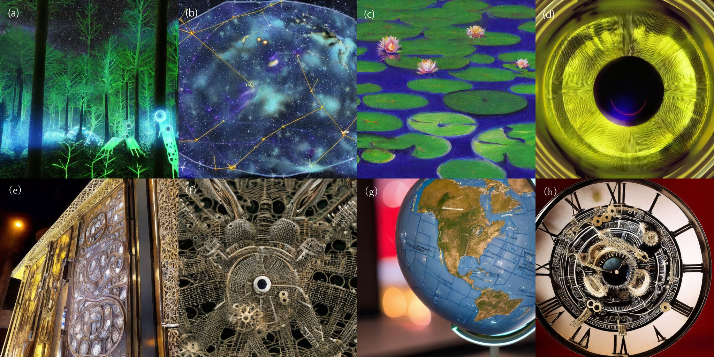

# Stable Diffusion 1024x1024 Pixel Image Generator (CLI)


Fig.1 The final output of Task(2): (a) Futuristic Forest Details, (b) Cosmic Constellation Map, (c) Paint Strokes of a Virtual Reality Art (d) Augmented Human Eye,  (e) Architectural Marvels in a Smart City, (f) Macro Shot of a Nano-Insect, (g) Interactive Globe Details, (h) Clockwork of a Time Machine

▶ Generated image files (1024×1024) are located in [this directory](./img/).
## Overview

This project aims to generate high-resolution 1024x1024 pixel images using the Stable Diffusion model 1.4/1.5 and an advanced upsampler prototype. It is specifically designed to meet the requirements of strategically important clients who demand higher image resolutions than what is currently available in the standard Stable Diffusion packages.

### Features

- Generate 1024x1024 pixel images from given prompts.
- Utilizes Stable Diffusion 1.4/1.5 model.
- Runs locally on Linux.

## Requirements

- Python 3.8 or higher
- Version **0.0.15** of the **k-diffusion** package
- Version **4.31.0** of the **transformers** package
- Docker (for DevContainer support)

## Installation

### Using DevContainer in Visual Studio Code

1. Clone this repository.
   ```bash
   git clone https://github.com/hogaku/StableDiffusion-Upscaler-CLI.git

2. Open the project folder in Visual Studio Code.
    ```bash
    cd StableDiffusion-Upscaler-CLI
    code .
3. When Visual Studio Code prompts you to reopen the folder in a DevContainer, click "Reopen in Container". Alternatively, you can press F1 and select the "Remote-Containers: Reopen Folder in Container" command.
This will build the DevContainer defined in the .devcontainer folder, installing all the required dependencies automatically.

### Manual Installation
1. Clone this repository.
   ```bash
   git clone https://github.com/hogaku/StableDiffusion-Upscaler-CLI.git

2. Open the project folder in Visual Studio Code.
    ```bash
    cd StableDiffusion-Upscaler-CLI
    code .
3. Install required packages.
   ```bash
   pip install -r requirements.txt
4. Run the setup script.
   ```bash
   ./setup.sh

## Usage
Run the following command on your Linux terminal to generate a 1024x1024 pixel image.
    
    ```bash
    python main.py --seed=<YOUR_SEED> --prompt=<YOUR_PROMPT>

or

    ```bash
    python main.py -s=<YOUR_SEED> -p=<YOUR_PROMPT>

Replace <YOUR_SEED> and <YOUR_PROMPT> with the desired seed and prompt for image generation.

Example:
    
    ```bash
    python main.py --seed=12345 --prompt="A beautiful sunset over the mountains."

This will produce a 1024x1024 pixel image based on the prompt and seed provided

